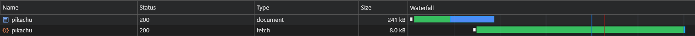

# Adina

**Ad**aptively **In**lined **A**ssets

Adina is a set of files that can be seamlessly integrated into any [Webpack](https://webpack.js.org)/[Rspack](https://rspack.dev) project setup, dramatically enhancing the loading speed of client-side rendered apps.
 
It was developed following my comprehensive case study of client-side rendering:
 
https://github.com/theninthsky/client-side-rendering

## How Does It Work?

1. The browser requests a page.
2. A serverless worker inlines the relevant assets for the requested page directly into the HTML response.
3. In the browser, a script extracts the inlined assets and passes them to a service worker for caching.
4. On subsequent visits, the service worker requests the page and includes an `X-Cached` header with all cached assets.
5. The serverless worker then responds with a `304 Not Modified` status if no changes are detected, or it adaptively inlines any new or missing assets into the HTML response.

Additionally, all fetch requests are preloaded immediately.

The following network snapshots help illustrate the impact of Adina on the load waterfall:

_**No Adina (code-splitting only):**_

_**Adina:**_

_**Adina Repeated Load (full cache):**_

Adina can also be used in a static setup, without the need for a serverless worker:

_**Adina (Static):**_

## Installation

1. Integrate the `public`, `scripts`, and `src` folders into your existing project.
2. Carefully merge the contents of the `rspack.config.js` file with your own.
3. Install any missing dependencies specified in `rspack.config.js`.
4. Import `utils/service-worker-registration.ts` in your main index file.
